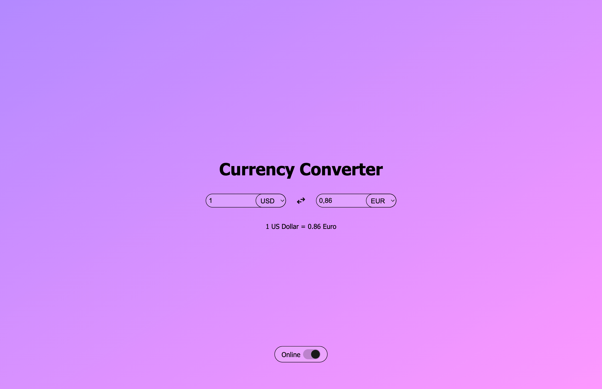
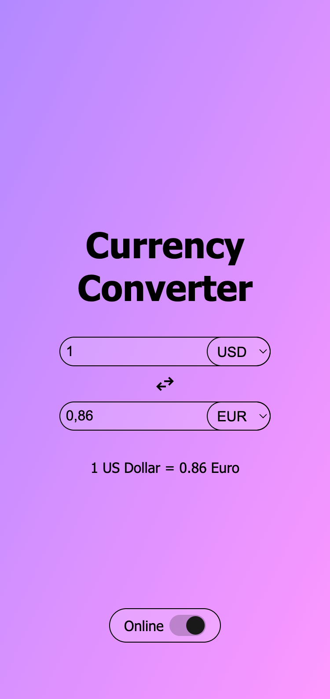
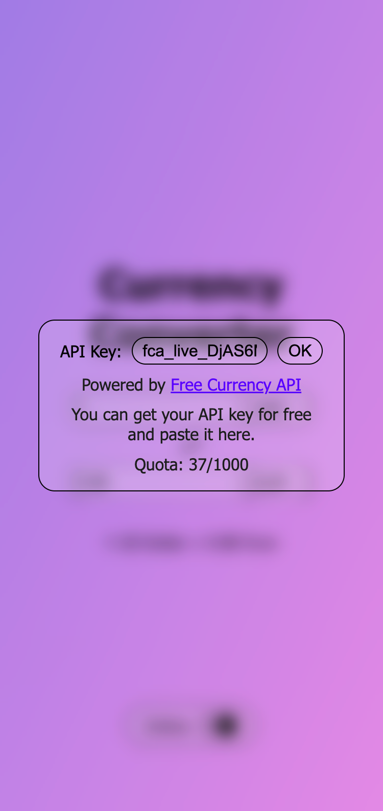

# Currency Converter With Vanilla JS

## Overview

This is a dynamic currency converter that fetches online rates from Free Currency API using an API key supplied by the user. It also supports an offline mode.

[Live Demo](https://emretantu.github.io/currency-converter-js)

If you don't want to create an account and my monthly quota isn't exhausted, you can use my API key:
```
fca_live_DjAS6McHBVTlWw77zOuh3NNzus6savzwUz0qrNif
```

## Table of Contents
- [Project source](#project-source)
- [The challenge](#the-challenge)
- [Screenshot](#screenshot)
- [Links](#links)
- [Built with (tech-stack)](#built-with-tech-stack)
- [What you need to know](#what-you-need-to-know)
- [Author](#author)

## Project source

The design was not taken from anywhere. I defined the entire UI design and behavior of the project.

## The challenge

Users should be able to:

- Convert values between currencies
  - Show only the currencies available from the data source (no hardcoded default currency list)
  - Recalculate on every input as the user types
  - Allow both input fields to be editable
  - Provide a swap feature
  - In addition to numeric conversion, show unit conversion text between the two currencies (use singular/plural names where appropriate and decide decimal precision according to the API data)
- Use Free Currency API for conversion rates
- Allow demo to run with offline data as well
- Provide an online/offline mode switcher (the user can enter their own API key)
- Persist the user's API key and last currency selections in local storage
- Show an optimal layout depending on device screen size (responsive)
- Show hover and focus states for interactive elements

## Screenshot



## Links

- [Live Demo](https://emretantu.github.io/currency-converter-js)
- [Free Currency API](https://freecurrencyapi.com/)

## Built with (tech stack)

- HTML
- CSS
- Vanilla JavaScript
- Free Currency API

## What You Need to Know

- The tech stack listed above
- The Fetch API
- JS concepts like Promises and async/await

## Author

**Emre Tantu**
- Website - [emretantu.dev](https://www.emretantu.dev)
- Contact - [hello@emretantu.dev](mailto:hello@emretantu.dev)
- LinkedIn - [in/emretantu](https://www.linkedin.com/in/emretantu/)
- Twitter - [@emretantu](https://www.twitter.com/emretantu)

---
---

# 🇹🇷 Döviz Dönüştürücü — Vanilla JS ile

## Genel Bakış

Bu proje, kullanıcının sağladığı API key ile Free Currency API'den çevrimiçi (online) veri çeken, aynı zamanda **offline mode** desteği olan dinamik bir döviz dönüştürücüdür.

[Live Demo](https://emretantu.github.io/currency-converter-js)

Üyelik oluşturmak istemiyorsanız ve benim aylık kotam dolmamışsa benim API key'imi kullanabilirsiniz:
```
fca_live_DjAS6McHBVTlWw77zOuh3NNzus6savzwUz0qrNif
```

## İçindekiler
- [Proje kaynağı](#proje-kaynagi)
- [İsterler (Gereksinimler)](#isterler-gereksinimler)
- [Ekran Görüntüleri](#ekran-goruntuleri)
- [Linkler](#linkler)
- [Kullanılan Teknolojiler](#kullanilan-teknolojiler)
- [Bilmeniz Gerekenler](#bilmeniz-gerekenler)
- [Geliştirici](#geliştirici)

## Proje kaynağı

Tasarım herhangi bir yerden alınmamıştır. Projenin tüm tasarımını ve davranışlarını ben belirledim.

## İsterler (Gereksinimler)

Kullanıcı şunları yapabilmelidir:

- Para birimleri arasında dönüşüm yapabilmek
  - Veri kaynağında bulunan currency'ler gösterilsin (hardcoded varsayılan liste olmasın)
  - Kullanıcı rakam yazdıkça her input'ta yeniden hesaplama yapılsın
  - Her iki alan da düzenlenebilir (editable) olsun
  - Swap (değiş tokuş) özelliği olsun
  - Sayısal dönüşüm dışında, iki para biriminin birim dönüşümü metinsel olarak gösterilsin. Gerekirse currency isimleri tekil/çoğul kullanılmalı ve virgülden sonra kaç hane gösterileceğine API verisi göre karar verilsin
- Dönüşüm oranları için Free Currency API kullanılsın
- Demo için offline verilerle çalışabilme
- Online/offline geçiş anahtarı (kullanıcı kendi API key'ini girebilsin)
- Kullanıcının API key'i ve son tercih edilen para birimleri local storage'da saklansın
- Cihaz ekran boyutuna göre optimal responsive layout gösterilsin
- Etkileşimli elemanlar için hover ve focus durumları görülebilsin

## Ekran Görüntüleri

  

## Linkler

- [Live Demo](https://emretantu.github.io/currency-converter-js)
- [Free Currency API](https://freecurrencyapi.com/)

## Kullanılan Teknolojiler

- HTML
- CSS
- Vanilla JavaScript
- Free Currency API

## Bilmeniz Gerekenler

- Yukarıdaki tech stack
- Fetch API
- Promise ve async/await gibi JS kavramları

## Geliştirici

**Emre Tantu**
- Website - [emretantu.dev](https://www.emretantu.dev)
- İletişim - [hello@emretantu.dev](mailto:hello@emretantu.dev)
- LinkedIn - [in/emretantu](https://www.linkedin.com/in/emretantu/)
- Twitter - [@emretantu](https://www.twitter.com/emretantu)
